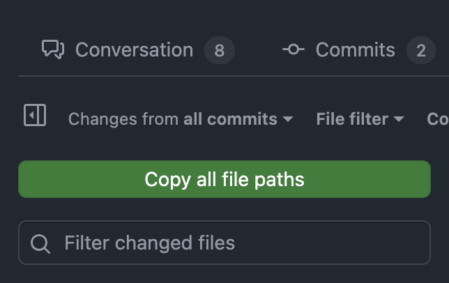
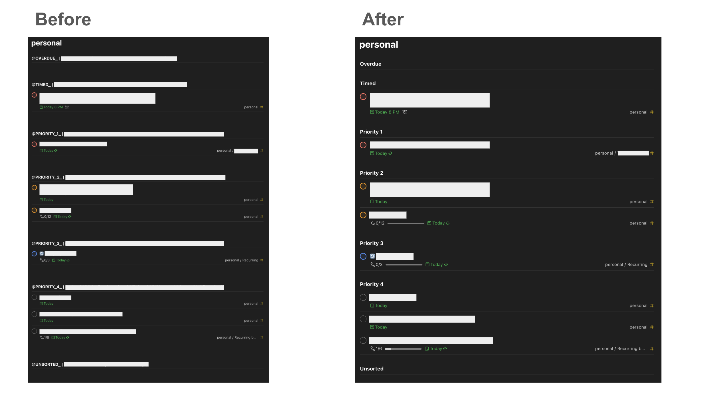
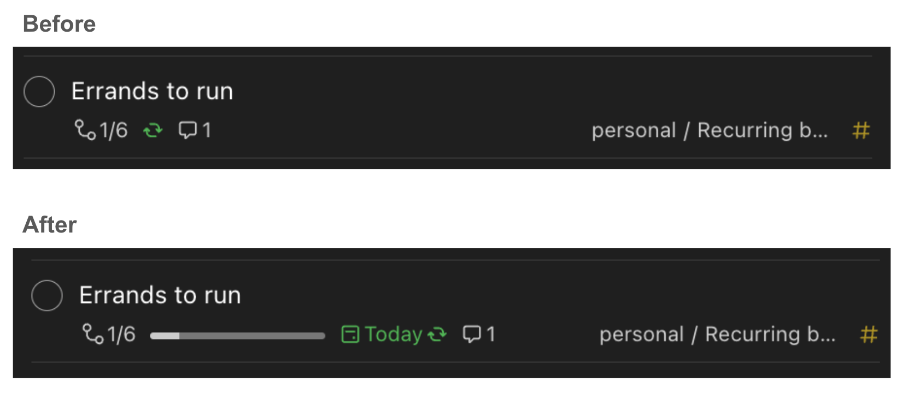
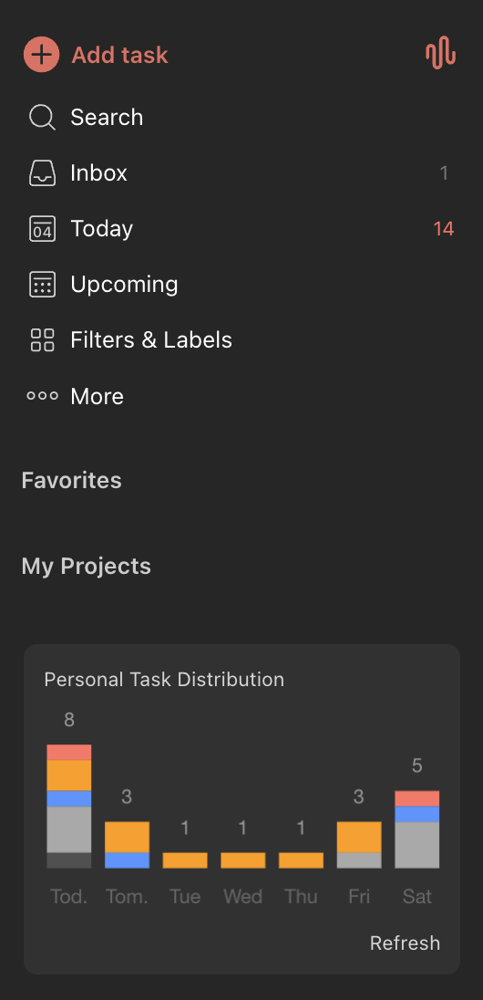

# My Tampermonkey Scripts

A collection of my Tampermonkey scripts I've made.

## githubcopyfilepaths.js

Adds button to copy all file paths of a Github PR.

This is helpful if I want to quickly share all file paths to Cursor or Claude Code so it has context on the specific files I want to review or change.

## todoistfiltertidy.js

Renames Todoist filter sections to readable names and tightens the spacing.

I rely heavily on Todoist filter sections but Todoist does now have section naming in filter views. Additionally, spacing is too much for my taste. This script renames my sections and reduces the spacing.

## todoistprogessbars.js

Adds progress bars to Todoist tasks that have subtasks.

## todoistspread.js

Adds upcoming daily personal task counts graph to Todoist sidebar.

When picking what days to schedule one-off chores/personal tasks, it is not easy to see how busy my upcoming week is. I either have to scroll the Todoist Upcoming view or hover over individual dates when scheduling the task. This script uses Todoist API to fetch all my upcoming/overdue/unsorted tasks, filter out my work tasks, and build a chart so I can see what my week looks like at a glance. It auto-refreshes on any task change.

